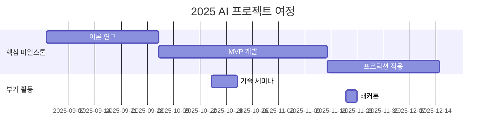

# Stockelper-Lab

<h1 align="center"> Stockelper Lab </h1>

<div align="center">
<a href="https://pseudo-lab.com"></a>
<a href="https://discord.gg/EPurkHVtp2"></a>
<a href="https://github.com/Pseudo-Lab/Stockelper-Lab/stargazers"></a>
<a href="https://github.com/Pseudo-Lab/Stockelper-Lab/network/members"></a>
<a href="https://github.com/Pseudo-Lab/Stockelper-Lab/pulls"></a>
<a href="https://github.com/Pseudo-Lab/Stockelper-Lab/issues"></a>
<a href="https://github.com/Pseudo-Lab/Stockelper-Lab/graphs/contributors"></a>
<a href="https://hits.seeyoufarm.com"></a>
</div>
<br>

<!-- sheilds: https://shields.io/ -->

<!-- hits badge: https://hits.seeyoufarm.com/ -->

> Welcome to Stockelper Lab! We build an AI-powered stock investment assistant leveraging LangGraph multi-agent workflows, knowledge graph (Neo4j), vector search, and automated data pipelines to support market/fundamental/technical analysis and portfolio strategies.

🚀 Stockelper Lab — 가짜연구소 오픈 리서치 프로젝트

프로젝트 계획표 : https://www.notion.so/chanrankim/Stockelper-Lab-254963ffa3ee80dfa0b3e919679ad167

## 🌟 프로젝트 목표 (Project Vision)

_"AI 투자 보조에서 실거래까지, 실전형 에이전트 연구"_

- LangGraph 기반 멀티 에이전트 설계/운영 연구 (Supervisor·Router·분석 에이전트)
- Neo4j 지식그래프·Milvus 벡터DB·MongoDB 문서스토어를 통한 하이브리드 검색
- Market/Fundamental/Technical/Portfolio/Strategy 에이전트 워크플로우 고도화
- Airflow 기반 크롤링·임베딩·동기화 파이프라인 설계와 운영 자동화
- KIS/DART/YouTube 등 외부 API 연동, 모의→실거래까지 End-to-End 검증
- 오픈소스 협업과 실전 지식 공유, 실패 기록과 재현으로 학습 가속
- 사건 기반 주가 예측 시스템 구축

## 🧑 역동적인 팀 소개 (Dynamic Team)

| 역할                      | 이름              | 기술 스택 배지                                                                                                     | 주요 관심 분야               |
| ------------------------- | ----------------- | ------------------------------------------------------------------------------------------------------------------ | ---------------------------- |
| **Project Manager** | 정영상            |    | 생성형 AI/추천 시스템 최적화 |
| **Member**          | 레오나르도 다빈치 |       | 데이터 파이프라인 설계       |

## 🚀 프로젝트 로드맵 (Project Roadmap)



## 🛠️ 우리의 개발 문화 (Our Development Culture)

**우리의 개발 문화**

```python
class CollaborationFramework:
    def __init__(self):
        self.tools = {
            'communication': 'Discord',
            'version_control': 'GitHub Projects',
            'ci/cd': 'GitHub Actions',
            'docs': 'Github Wiki'
        }
  
    def workflow(self):
        return """주간 사이클:
        1️⃣ 월요일: 스프린트 플래닝 (Notion 타임라인 공유)
        2️⃣ 디스코드 or 오픈카톡방 통해 상시 개발 소통
```

## 💻 주차별 활동

| 날짜     | 내용    | 발표자 |
| -------- | ------- | ------ |
| 2025/09/08 | OT      |        |
| 2025/09/15 | 개발 진행 | 미정   |
| 2025/09/22 | 개발 진행 | 미정   |
| 2025/09/29 | 개발 진행 | 미정   |
| 2025/10/06 | 추석 연휴 | 미정   |
| 2025/10/13 | 개발 진행 | 미정   |
| 2025/10/20 | 개발 진행 | 미정   |
| 2025/10/27 | 개발 진행 | 미정   |
| 2025/11/03 | 개발 진행 | 미정   |
| 2025/11/10 | 개발 진행 | 미정   |
| 2025/11/17 | 개발 진행 | 미정   |
| 2025/11/22 | 2025 Grand Gathering | 미정   |
| 2025/11/24 | 피드백 반영 및 유지보수 | 미정   |
| 2025/12/01 | 피드백 반영 및 유지보수 | 미정   |
| 2025/12/08 | 피드백 반영 및 유지보수 | 미정   |
| 2025/12/.. | 피드백 반영 및 유지보수 | 미정   |

## 💡 개발 현황

- [Stockelper (Core Repo)](https://github.com/Pseudo-Lab/Stockelper): LLM 서버, 에이전트, 데이터 파이프라인, 인프라
- [System Architecture Docs](https://github.com/Pseudo-Lab/Stockelper/blob/main/README.md#-%EC%8B%9C%EC%8A%A4%ED%85%9C-%EC%95%84%ED%82%A4%ED%85%8D%EC%B2%98): 구성 요소 및 흐름도
- [Quick Start (Compose)](https://github.com/Pseudo-Lab/Stockelper/blob/main/README.md#-%EB%B9%A0%EB%A5%B8-%EC%8B%9C%EC%9E%91): 네트워크 생성, 빌드/실행 가이드

## 🌱 참여 안내

- 러너로 참여 — 연구·개발·테스트 등 실행
- 청강 참여 — 공개 세션 참여 가능

❗️참여 링크: [가짜연구소 디스코드](https://discord.gg/EPurkHVtp2)
❗️커뮤니케이션 채널: 디스코드 #{{채널명}}

**누구나 청강을 통해 모임을 참여하실 수 있습니다.**

1. 특별한 신청 없이 정기 모임 시간에 맞추어 디스코드 채널로 입장
2. Magical Week 중 행사에 참가
3. Pseudo Lab 행사에서 만나기

## Acknowledgement 🙏

이 프로젝트는 가짜연구소 Open Academy로 진행됩니다.
여러분의 참여와 기여가 ‘우연한 혁명(Serendipity Revolution)’을 가능하게 합니다. 모두에게 깊은 감사를 전합니다.
OOO is developed as part of Pseudo-Lab's Open Research Initiative. Special thanks to our contributors and the open source community for their valuable insights and contributions.

## About Pseudo Lab 👋🏼

[Pseudo-Lab](https://pseudo-lab.com/) is a non-profit organization focused on advancing machine learning and AI technologies. Our core values of Sharing, Motivation, and Collaborative Joy drive us to create impactful open-source projects. With over 5k+ researchers, we are committed to advancing machine learning and AI technologies.

<h2>Contributors 😃</h2>
<a href="https://github.com/Pseudo-Lab/Stockelper-Lab/graphs/contributors">
  
</a>
<br><br>

<h2>License 🗞</h2>

This project is licensed under the [MIT License](https://opensource.org/licenses/MIT).

🚩 추가 팁 (Usage Tips)

- 각 항목 내 {{ }} 표시된 부분을 프로젝트에 맞게 꼭 수정하세요.
- 불필요한 프로젝트 유형 예시는 제거하거나 교체해 명확하게 하세요.
- 로드맵과 활동내역 부분에 Mermaid 다이어그램 등을 이용해 시각적으로 표현하는 것을 추천합니다.
- 체크박스(✅)와 표를 적절히 활용하면 진행 상황 한눈에 파악이 쉽습니다.
- ‘빌더’와 ‘러너’의 역할 분담과 상호 피드백 문화 강화에 README 내 문장으로 강조를 절대 잊지 마세요.
- README가 단순 안내서 이상으로 공동체 철학과 가치를 담는 협업 선언문임을 인지하고, 누구나 읽고 이해하기 쉽도록 간결 명료하게 작성하세요.
